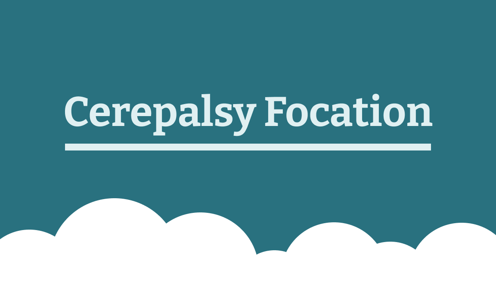
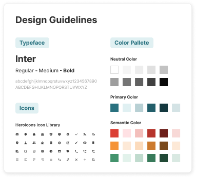

---
 


---
[Deskripsi Aplikasi](#-deskripsi-aplikasi) | [Lingkungan Pengembangan](#-lingkungan-pengembangan) | [System Design](#-system-design) | [Requirement Gathering and Prototyping](#-requirement-gathering-and-prototyping) | [Implementation](#-implementation)| [Deployment](#-deployment) | [Developer](#-developer)
:---:|:---:|:---:|:---:|:---:|:---:|:---:

---

## 💡 Deskripsi Aplikasi
__Simalab IPB__
<p align="justify"> Merupakan sebuah KMS yang dapat dijadikan sebagai panduan bagi para orang tua dengan anak penderita cerebral palsy dan ingin mengakses berbagai informasi mengenai cerebral palsy terutama food education. Fungsi utama yang ditawarkan pada KMS ini seperti layaknya komunitas dimana pengguna dapat saling bertanya satu sama lain dalam sebuah forum bersama dan berkomentar pada post/pertanyaan masing-masing.
.</p>

---

## 🚧 Lingkungan Pengembangan

__Software__
```
- Windows 10 64 bit
- Postman v9   
- Visual Code Studio v1.62.3
- Figma
```
__Hardware__
```
- i5-8250U @ 1.60GHz 
- 8GB RAM
```
__Tech Stack__
```
- Frontend  : Next.js dan Tailwind CSS
- Backend   : Express.js dan MongoDB Atlas
```
---

## 🌐 Sistem Design

**Use Case Diagram** | 
------------ |
  |


 **Entity Relationship Diagram** | 
------------ |
  |

---

## 🙋 Requirement Gathering dan Prototyping

__Stakeholders__

<p align="justify"> <code><b>Tim Cerepalsyfocation</b></code> merupakan sebuah tim PKM dari IPB yang memiliki niat untuk membantu mengedukasi orang tua dengan anak penderita cerebral palsy terutama dalam hal gizi. Mereka merupakan client kami dalam projek ini dan mereka ingin membuat sebuah website yang bertugas sebagai pusat informasi bagi siapapun pengguna yang ingin mengetahui lebih lanjut mengenai cerebral palsy terutama dari sisi gizi atau food education.</p>
  
<p align="justify"> <code><b>Komunitas Penyandang Cerebral Palsy</b></code> merupakan salah satu stakeholder dikarenakan kami dapat mempelajari kegiatan apa saja yang biasanya diadakan oleh komunitas dan juga masukan-masukan yang dapat mereka sampaikan langsung kepada client kami maupun kami selaku developer. Sekiranya masukan dari mereka dapat kami terapkan untuk website ini kedepannya.</p>
  
<p align="justify"> <code><b>Orang tua dengan anak penderita cerebral palsy</b></code> merupakan target pengguna utama kami dimana sesuai dengan niat atau tujuan dari client kami yaitu mengedukasi para orang tua agar lebih paham lagi terkait pentingnya gizi bagi anak penderita cerebral palsy, jadi kami selaku developer tentu saja ingin memberikan yang terbaik untuk pengguna demi tercapainya tujuan dari client kami.</p>

<p align="justify"> <code><b>Dokter</b></code> merupakan salah satu stakeholder dikarenakan untuk saat ini dokter dapat memberikan informasi umum kepada kami cerebral palsy, namun kedepannya mungkin saja kami dapat mengajak bebagai dokter yang paham terkait penyakit cerebral palsy ini untuk bergabung ke dalam forum cerepalsy focation dan menjawab pertanyaan-pertanyaan yang ada di forum</p>

__User Needs__

Setelah berdiskusi dengan client terkait apa saja yang sekiranya dibutuhkan oleh pengguna, berikut merupakan 3 kebutuhan yang diperlukan oleh pengguna:
1. Mendapatkan informasi umum terkait cerebral palsy.
2. Sarana untuk bertanya kepada forum terkait cerebral palsy.
3. Mendapatkan informasi khusus terkait kebutuhan gizi pengidap cerebral palsy.

__Solusi__

<p align="justify"> Dari needs yang sudah didefinisikan diatas, akhirnya kami mendapatkan ide terkait beberapa fitur yang perlu dibuat agar website cerepalsy focation ini dapat menjawab seluruh kebutuhan pengguna dan juga dapat memberikan pengalaman yang baik kepada pengguna dalam ketika menggunakannya. Disini kami bagi menjadi 2 bagian, yaitu fitur untuk user umum dan juga super user (admin). Berikut merupakan serangkaian fitur yang kami tawarkan pada website ini:</p>
   
<code><b>User Umum</b></code>
1. Membuat post pertanyaan ataupun pengalaman.
2. Menulis komentar pada post forum.
3. Upvote dan downvote pada post forum.
4. Membagikan post forum ke media lain

<code><b>Super User (Admin)</b></code>
1. Membuat dan Mengupdate konten FAQ
2. CRUD konten forum

__Prototyping__

<b>Design Guideline</b>


---

## 🚀 Deployment

__Website Cerepalsy__

https://cerepalsy.vercel.app/

---

## 👨‍👩‍👦‍👦 Developer
<table>
    <thead>
        <tr>
            <th></th>
            <th>Nama</th>
            <th>Nim</th>
            <th>Role</th>
        </tr>
    </thead>
    <tbody>
        <tr>
            <td>1</td>
            <td>Rabbani Elha Ahmad</td>
            <td>G64170078</td>
            <td>Frontend</td>
        </tr>
        <tr>
            <td>2</td>
            <td>Zidane Ibrahim Fadela</td>
            <td>G64180015</td>
            <td>Project Manager</td>
        </tr>
        <tr>
            <td>3</td>
            <td>Mohammad Thareeq I.</td>
            <td>G64180041</td>
            <td>Backend</td>
        </tr>
        <tr>
            <td>4</td>
            <td>Irsyad Musyaffa</td>
            <td>G64180048</td>
            <td>Frontend</td>
        </tr>
        <tr>
            <td>5</td>
            <td>Rafiandi Ammar Putra</td>
            <td>G64180072</td>
            <td>UI/UX Designer</td>
        </tr>
    </tbody>
</table>
